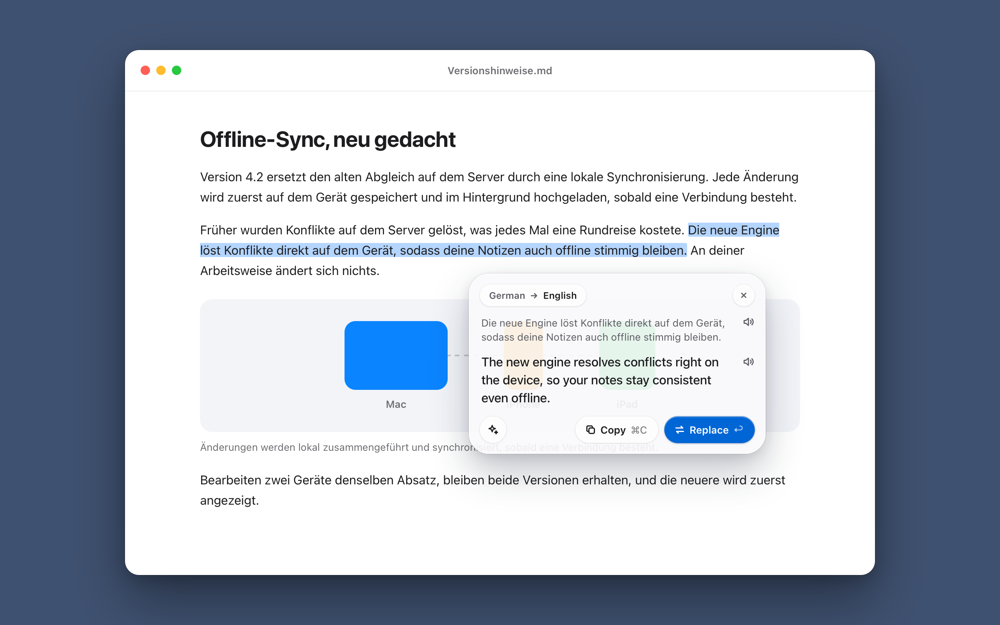
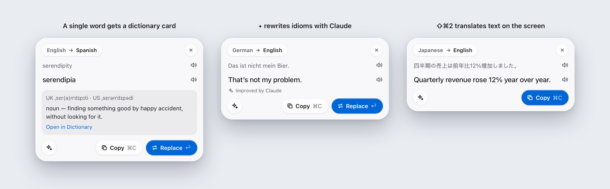
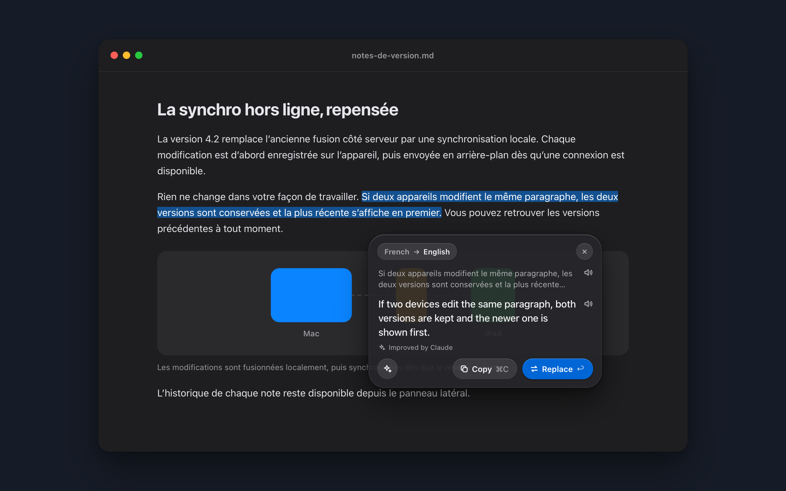
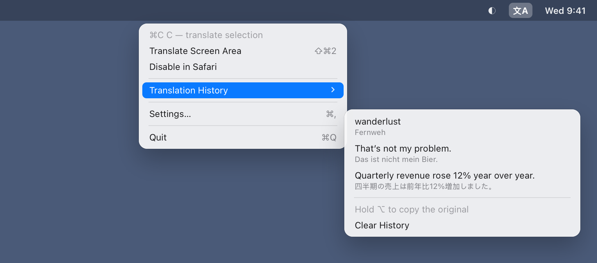
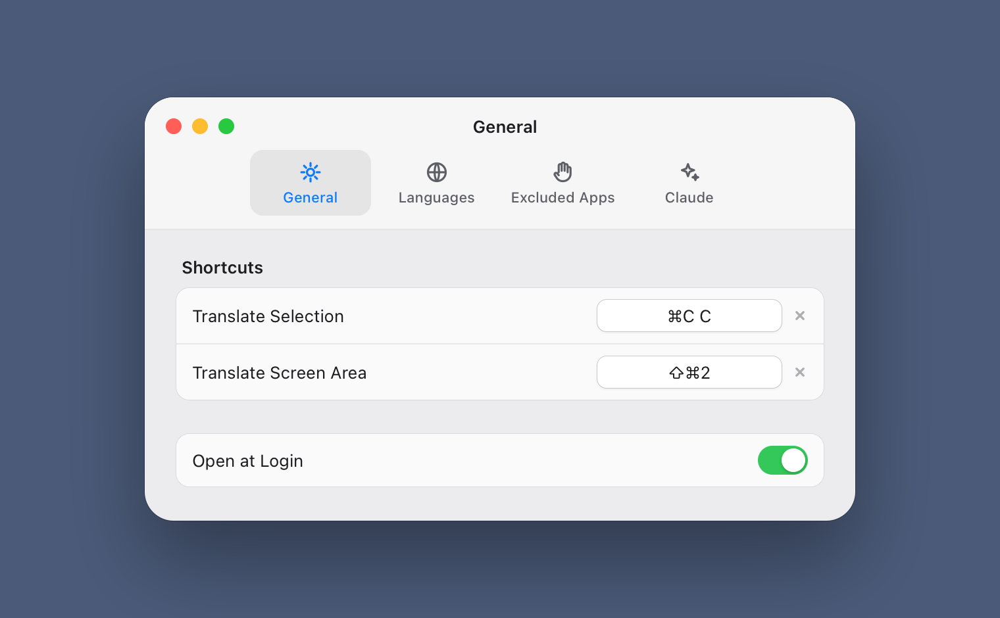

<p align="center">
  
</p>

<h1 align="center">Slovo</h1>

<p align="center">
  A native macOS translator that lives in the menu bar.<br>
  Select text anywhere, press <b>⌘C</b> twice, and a Liquid Glass popup translates it right next to your selection.
</p>

<p align="center">
  
</p>

Translation runs on your Mac with Apple Translation: no account, no network, nothing leaves the device unless you ask Claude to polish a translation.

## Features

- **⌘C C anywhere.** Copy as usual, press ⌘C once more, and the translation appears under the selection. Prefer one shortcut? Record your own in Settings.
- **Replace in place.** ↩ pastes the translation over the selection, then puts your clipboard back as it was. Read-only text gets Copy instead.
- **Automatic languages.** Slovo detects the language of the text. Anything foreign is translated into your language; text in your language goes back into the language you last translated from, so a reply lands in the language of the conversation. The language pill in the popup switches either side for a one-off.
- **Screen text.** ⇧⌘2 opens the system region picker. Text in the area is recognized on-device with Vision, wrapped lines are rebuilt into paragraphs, and the result opens in the same popup. Works on images, videos and anything you can't select.
- **Single words.** One word gets a card from Dictionary.app: pronunciation when the dictionary has it, the start of the entry and a link to the full one.
- **Read aloud.** 🔊 next to the original and the translation reads them with the best installed system voice for each language.
- **Improve with Claude.** ✦ (⌘I) sends the text and Apple's draft to Claude, which rewrites it to read naturally: idioms, slang, tone. Optional, with your own API key.
- **History.** The last ten translations are in the menu bar menu: click to copy a translation, ⌥-click to copy the original.
- **Excluded apps.** Turn ⌘C C off in apps where you copy twice on purpose, such as a terminal or code editor.
- **Light and dark, English and Russian UI.** The interface follows the system appearance and language.

<p align="center">
  
</p>

<p align="center">
  
</p>

## Menu bar and settings

Slovo has no Dock icon. Everything else lives behind its menu bar icon: screen translation, the per-app switch for the app you were just in, history and settings.

<p align="center">
  
</p>

Settings are split into four tabs:

| Tab | What's there |
| --- | --- |
| General | Shortcuts for translating the selection (⌘C C by default) and a screen area (⇧⌘2), Open at Login |
| Languages | Your language, downloaded languages, downloading new ones |
| Excluded Apps | Apps where ⌘C C does nothing |
| Claude | Anthropic API key (kept in the Keychain) and the model: Claude Opus 5.5, Sonnet 5.5 or Haiku 4.5 |

<p align="center">
  
</p>

## Keyboard

| Where | Keys | Action |
| --- | --- | --- |
| Anywhere | ⌘C C | Translate the selection (configurable) |
| Anywhere | ⇧⌘2 | Translate a screen area (configurable) |
| Popup | ↩ | Replace the selection with the translation |
| Popup | ⌘C | Copy the translation |
| Popup | ⌘I | Improve with Claude |
| Popup | Esc | Close |

## Requirements

- macOS 26 or later (Apple Translation, Liquid Glass, Vision document recognition)
- Xcode 26 to build
- Accessibility permission, for ⌘C C and Replace
- Screen Recording permission, only for ⇧⌘2; macOS asks the first time

## Build and run

```bash
make run
```

`scripts/build-app.sh` builds the SwiftPM target, compiles the Icon Composer icon with `actool`, wraps everything into `build/Slovo.app` and signs it with the first Apple Development certificate it finds (set `CODESIGN_IDENTITY` to pick another). A stable signature matters: with ad-hoc signing macOS forgets the Accessibility permission after every rebuild.

On first launch, allow Slovo in **System Settings → Privacy & Security → Accessibility**.

To open the popup without a shortcut, for example while working on the UI:

```bash
open build/Slovo.app --args --demo "Some text to translate"
```

## Privacy

- Translation, language detection, text recognition, the dictionary and speech all run on the device.
- Text goes to Anthropic only when you press ✦, and only if you saved an API key. Requests are billed to your Anthropic account.
- History and settings stay in Slovo's preferences on this Mac; Clear History in the menu wipes the history.

## How it works

| File | Role |
| --- | --- |
| `DoubleCopyMonitor` | Watches for ⌘C pressed twice within 0.45 s, by key code, so it works with any keyboard layout |
| `GlobalHotKey`, `HotKeySettings`, `KeyCombo` | Recordable system-wide shortcuts registered with the Carbon Event Manager |
| `SelectionInspector` | Reads the focused element through the Accessibility API: whether it's editable and where the selection is |
| `LanguageCatalog`, `LanguageDetector` | Apple Translation's languages, one variant per language, and detection with `NLLanguageRecognizer` |
| `PopupModel`, `PopupView` | Translation with `TranslationSession`, the popup's states and its SwiftUI views |
| `PopupController` | A non-activating `NSPanel` in an `NSGlassEffectView`, so the source app keeps focus and Replace can paste with ⌘V |
| `ScreenTextCapture` | `screencapture -i` for the region, then Vision's `RecognizeDocumentsRequest` |
| `DictionaryLookup`, `Speaker` | Dictionary.app entries and `AVSpeechSynthesizer` |
| `ClaudeTranslator` | Streams a Messages API request over `URLSession`, with server-side fallback on refusals |

